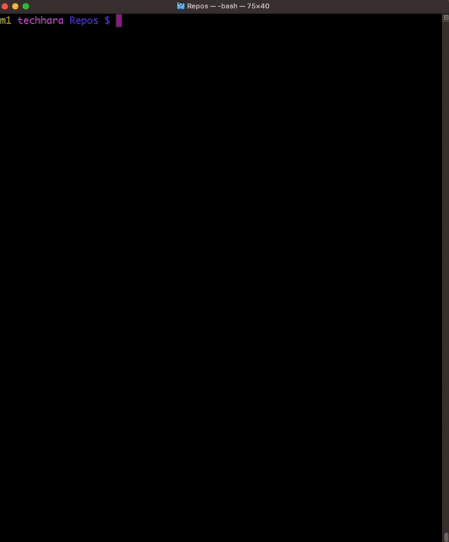

# Typescript Setup for VSCode

This repo contains a script that automates
- creating a new typescript project
- configure so that it is ready to debug with VSCode

## Prerequisite
- `node` version 16 or greater
- `npm i -g typescript`

## Instruction
Simply run the [script](./setup_ts.sh) with bash and provide project name (i.e., folder name).